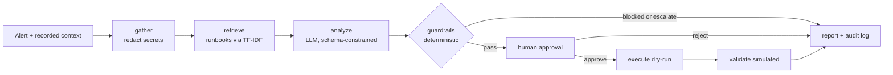

# Architecture

## Trust boundaries

| Data | Trusted? | Used by |
|---|---|---|
| Namespace, restart count, recent deploy, replicas, CPU | Yes (cluster API in live mode) | policy layer |
| Logs, events, annotations | **No** (attacker-influenced) | LLM only, redacted and wrapped in tags |
| LLM output | **No** | validated by schema, then by policy |

## Live mode (not implemented)

Replace `gather` with Kubernetes API + Prometheus reads (read-only ServiceAccount), and `execute` with
`kubectl ... --dry-run=server` followed by an approved apply. `KubeSentinel(dry_run=False)` raises
`NotImplementedError` on purpose.

## Production swaps

TF-IDF retrieval -> embeddings + a vector DB. Auto-generated facts -> live metrics. Simulated validation ->
pre/post state comparison.
